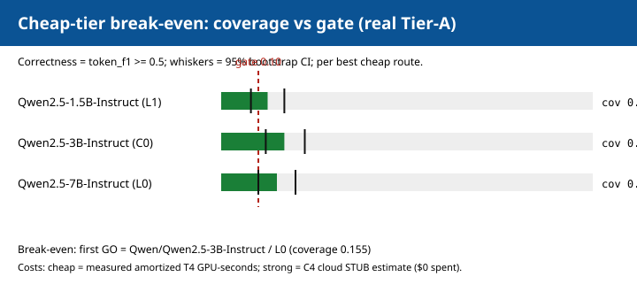
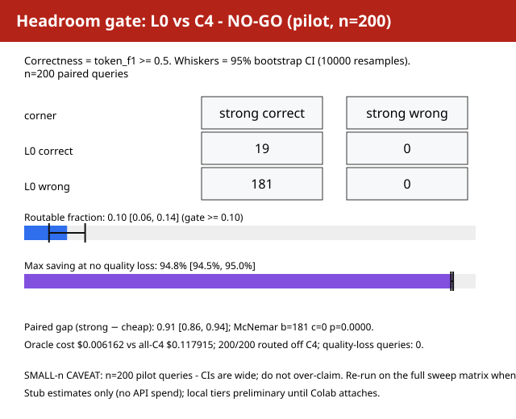
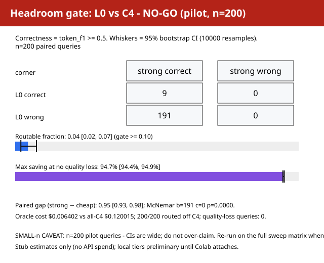

# costsmart-rag

[](#reproducing)
[](pyproject.toml)
[](#rigor-and-limitations)

**Measured result (read first).** The routing gate is cleared. In a controlled
three-tier sweep on 200 real NQ + HotpotQA + MuSiQue queries with 3x-majority
stable labels, the cheap closed-book route first clears the **0.10
exploitable-separation gate** at **Qwen2.5-3B** (coverage **0.155 [0.105,
0.205]**, measured amortized **3.27 GPU-s/query**); **Qwen2.5-7B is
statistically indistinguishable** (**0.150 [0.100, 0.200]**) and Apache-2.0,
so it is the commercially deployable choice. Against an **exhaustive oracle**
over the joint (model x retrieval depth x reasoning strategy) space, the
oracle ceiling is **~94% saving at no measured quality loss**. The lever is
**tier capability, not query difficulty** - reweighting the query mix did not
open the gate. The 1.5B cheap tier does not clear the gate on this route
(coverage 0.095), which is the baseline the 3B tier improves on. Full framing
and caveats: [`REPORT.md`](REPORT.md).

Existing LLM routers treat the query as the only input and the model as the
only action. In a RAG setting, retrieval produces strong difficulty signals
for free, and retrieval depth is itself a cheap action - costsmart-rag routes
over the joint space and measures the resulting cost-quality frontier against
an exhaustive oracle.

## What this is

costsmart-rag is a **research artifact**, not a deployed product: a routed RAG
agent whose routing decision is measured rather than asserted. Retrieval runs
**before** routing, so post-retrieval signals (score margins, coverage,
agreement) become free router features. The router chooses from the joint
space of **model x retrieval depth x reasoning strategy**, and every claim is
scored against an **exhaustive oracle** that evaluates all routes per query.
The headline gate experiments are complete; the router-training and agent-loop
components ship as scaffolds and are not yet benchmarked (see Status below).

## How it works

Retrieval before routing -> free difficulty features -> joint model x depth x
strategy routing -> oracle-measured frontier.

## Key result

> The routing gate is cleared, by **tier capability, not query difficulty**.
> The cheap closed-book route (L0) first clears the 0.10
> exploitable-separation gate at **Qwen2.5-3B** (coverage **0.155 [0.105,
> 0.205]**); Qwen2.5-7B is statistically indistinguishable (0.150 [0.100,
> 0.200]) and Apache-2.0, so it is the commercially deployable choice. The
> oracle ceiling is ~94% saving at no measured quality loss. The 1.5B tier
> does not clear the gate on this route (coverage 0.095).

## Tier results

Coverage is the cheap-tier routable fraction (the tier is already correct
where the C4 stub is correct) with 95% bootstrap CIs, n=200 paired queries per
route. GPU-s/query is measured amortized T4 generation time; the cost ratio
`r` is the measured cheap cost over the stub cloud estimate (see limits).
The verdict is **per (tier x route)**: **3B is a GO on the closed-book L0
route specifically**, and a NO-GO on a different route is not a verdict on the
model.

| tier | route | coverage (95% CI) | GPU-s/query | cost ratio r | route verdict |
|---|---|---|---|---|---|
| Qwen2.5-1.5B | L0 | 0.095 [0.055, 0.140] | 1.00 | 0.166 | **NO-GO** |
| Qwen2.5-1.5B | L1 | 0.125 [0.080, 0.170] | 3.25 | 0.536 | GO (marginal) |
| Qwen2.5-3B | L0 | **0.155 [0.105, 0.205]** | 3.27 | 0.540 | **GO** |
| Qwen2.5-3B | L1 | 0.085 [0.050, 0.125] | 6.80 | 1.122 | NO-GO |
| Qwen2.5-3B | C0 | 0.170 [0.120, 0.225] | 5.07 | 0.836 | GO |
| Qwen2.5-7B | L0 | 0.150 [0.100, 0.200] | 1.86 | 0.306 | **GO** |
| Qwen2.5-7B | L1 | 0.065 [0.035, 0.100] | 8.03 | 1.325 | NO-GO |
| Qwen2.5-7B | C0 | 0.075 [0.040, 0.115] | 13.74 | 2.265 | NO-GO |

Routes: **L0** = closed-book direct (k=0), **L1** = retrieval k=5 direct,
**C0** = retrieval k=5 chain-of-thought. Source: `results/tiersweep-16/`
(`TIERS.md`, `tiers.json`).

## Committed figures



*Cheap-tier break-even: per-tier best-route coverage with 95% CIs against the
0.10 gate. The first closed-book L0 route to clear it is Qwen2.5-3B.*



*Real Tier-A headroom gate (Qwen2.5-1.5B closed-book L0 vs C4, n=200,
3x-majority labels): routable fraction 0.095 [0.055, 0.135], max saving 94.77%
at no quality loss, NO-GO.*



*Synthetic multi-hop mix headroom gate (Qwen2.5-1.5B closed-book L0 vs C4,
n=200, stable labels): routable fraction 0.045 [0.020, 0.075], NO-GO. Treated
as a pipeline smoke signal, not a benchmark conclusion.*

## Rigor and limitations

**Rigor.** The frontier is measured, not estimated: an exhaustive oracle over
all routes per query, frozen query sets, 10k-resample bootstrap CIs, McNemar
tests, 3x live repeats graded by strict majority (ties count incorrect), and
server-side model attestation (resolved revision + weight hash) for the 3B/7B
tiers in `results/tiersweep-16/`. No cloud route executes: **actual cloud spend
is $0**, so every dollar figure is a stub estimate.

**Honest limits.** Three caveats are load-bearing. First, the strong route
(C4) is a stub that is exactly correct on every query, so the gate's routable
fraction equals the measured cheap-tier accuracy and the McNemar tests are
degenerate (c=0); real cloud accuracy is untested. Second, L1/C0 degrade with
model size because larger checkpoints ramble past the 256-token cap, so the
closed-book L0 route is the clean cross-tier comparison. Third, the cost ratio
`r` mixes measured T4 GPU-seconds with a stub cloud estimate priced at pinned
rates, so the measured GPU-seconds/query column is the robust cost axis.
Local tiers run on a **remote GPU** - Google Colab, or a Kaggle GPU kernel
when the Colab free tier is exhausted - never on-device. Full discussion:
[`REPORT.md`](REPORT.md), "Key result" and "Scope and claim strength".

## What has shipped

- **Corpus + retrieval** (`src/costsmart/corpus`, `src/costsmart/retrieval`):
  synthetic Tier-A query sets (legacy pilot + a 75%-multi-hop mix) plus a
  committed **real** Tier-A corpus (50 NQ + 80 HotpotQA + 70 MuSiQue at
  `results/realdata-15/corpus.json`, fetched via the HF loader path by
  `scripts/fetch_tier_a.py` with per-dataset licence/revision/checksums),
  deterministic index builds, BM25 + hybrid retrieval, rerank, and
  post-retrieval features.
- **Telemetry + sweep harness** (`src/costsmart/eval/oracle_sweep.py`,
  `src/costsmart/telemetry`): exhaustive route sweeps into SQLite with
  per-row provenance (`generator_mode` / `retrieval_mode`, temperature, seed,
  git sha, config hash) plus CSV/JSONL export. Committed **1400-attempt
  matrices** in `results/costsweep-08/` (legacy mix) and
  `results/costmultihop-12/` (multi-hop mix: 400 measured L0/L1 + 1000
  cloud/C0 stub rows).
- **Eval + oracle** (`src/costsmart/eval`): deterministic Tier-A graders
  (EM / lenient-EM / token-F1), the headroom gate (contingency,
  routable-fraction, max saving, bootstrap CIs, McNemar) in
  `scripts/make_plots.py`, and the stable-oracle majority recount in
  `scripts/stable_oracle.py`.
- **Stable-oracle recounts** (`results/costfinal-10/`,
  `results/costmultihop-12/`, `results/realdata-15/`): 3x live repeats per
  measured pair, strict majority grading with ties counted incorrect
  (`src/costsmart/eval/stability.py`). The recount shows single-run label
  noise does not change the verdict, including on real Tier-A data.
- **Routing + verification + agent loop** (`src/costsmart/routing`,
  `src/costsmart/verify`, `src/costsmart/agent`): router training and
  baselines, verification critics, and the demo agent loop.
- **Remote GPU route** (Colab, plus `kernels/costsweep-13-local-sweep/`,
  `kernels/realdata-15-local-sweep/` and `kernels/tiersweep-16-local-sweep/`
  on Kaggle): the Kaggle kernel clones the repo, serves the pinned
  checkpoint, and resumes the committed DBs by cache key. The real-data and
  tier kernels fetch/use the real corpus and build the real index. Runbook
  logs are hash-pinned in `results/costmultihop-12/KAGGLE_PROVENANCE.md`,
  `results/realdata-15/KAGGLE_PROVENANCE.md` and
  `results/tiersweep-16/KAGGLE_PROVENANCE.md`.
- **Server-side model attestation** (`scripts/colab_local_tier.py`,
  `src/costsmart/telemetry/attestation.py`): the endpoint reports the
  resolved revision + weight hash, rows carry `model_revision` /
  `weights_sha256` / `attestation`, and `scripts/attestation_audit.py` flags
  any measured row without server provenance.
- **Cheap-tier break-even** (`scripts/tier_sweep.py`,
  `results/tiersweep-16/`): per-tier coverage + bootstrap CI, C4-vs-tier gap,
  McNemar and measured amortized GPU-seconds/query across Qwen2.5-1.5B/3B/7B.

## Status at a glance

| Area | Status |
|---|---|
| Skeleton / model interfaces / CLI | shipped |
| Corpus + retrieval | shipped (synthetic mixes + committed real Tier-A corpus) |
| Telemetry / sweep harness | shipped (1400-attempt matrices, per-row provenance) |
| Eval + oracle | shipped (headroom gate + stable recount) |
| Routing / router training | shipped (pilot `router-v1`; not yet on a real dataset) |
| Verification / agent loop / demo | shipped |
| Remote GPU route (Colab / Kaggle) | shipped |
| Tier-B judge validation | not started (captain-only hand labels; no reported number depends on it) |

## Reproducing

```sh
# tests (stdlib-only; `make test` needs pytest, which this env may lack)
PYTHONPATH=src python3 -m unittest discover -s tests

# recount the stable gate from committed telemetry (explicit paths required)
PYTHONPATH=src python3 scripts/stable_oracle.py \
  --sweep-db results/costmultihop-12/sweep.db \
  --repeats-db results/costmultihop-12/repeats.db \
  --out-dir /tmp/recount

# recompute the cheap-tier break-even table
PYTHONPATH=src python3 scripts/tier_sweep.py --out-dir /tmp/tiers \
  --run 1p5b=results/realdata-15/sweep.db:results/realdata-15/repeats.db \
  --run 3b=results/tiersweep-16/sweep-3b.db:results/tiersweep-16/repeats-3b.db \
  --run 7b=results/tiersweep-16/sweep-7b.db:results/tiersweep-16/repeats-7b.db
```

`scripts/stable_oracle.py` requires `--sweep-db`, `--repeats-db`, and
`--out-dir`: it refuses a bare invocation and refuses a sweep/repeats pair
drawn from different mixes, so it cannot silently recount the legacy pilot
mix when the reader means the multi-hop one.

## Make instructions

```sh
make install       # install package + dev extras (needs a networked env)
make index         # build the retrieval index
make sweep         # run the exhaustive route sweep (oracle telemetry)
make train-router  # train the router on sweep telemetry
make eval          # evaluate router vs exhaustive oracle
make report        # render REPORT.md figures
make test          # run pytest (pytest may be absent; use the unittest command above)
make lint          # run ruff
```

Individual CLI entrypoints are also available via
`python -m costsmart.cli <command>`.

Pinned model versions live in `config/models.yaml`; the cost model and pricing
snapshot live in `config/costs.yaml` (cloud routes are stub-estimated, never
executed). Experiment configs are under `config/experiments/`.
